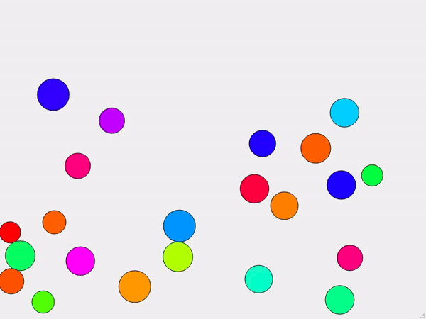

# Physics Engine

This library is intended to serve as a resource for applications utilizing 
complex physics equations and collision detection/response. At this time, only 
circular particles are supported.

The overall project layout is inspired by the [Boost project][1], and was 
developed in a Docker Dev Container with VS Code.
[Nic Holthaus' C++ units library][2] is used heavily throughout, and provides 
an extra layer of security for the underlying mathematical equations.

## Project Goals

The goals of this project were to experiment an existing units library 
and to make use of the features provided by C++20 for designing systems with 
a more generic, functional paradigm. I also wanted to learn more about 
designing libraries intended to be used by other developers.

Mostly, though, I just wanted to learn more about how physics engines were 
implemented. There's something incredibly satisfying about watching a bunch of 
particles fly into each other and bounce all over the place.



## Usage

### Units

This repository wraps [Nic Holthaus' C++ units library][2] under the namespace 
`physics::units`. For a more detailed look at what operations are available, 
as well as how to create new, custom units, see the project's github page.

### Vectors

The underlying mathematics make use of two-dimensional vectors to represent 
position, velocity, and acceleration. The standard addition, subtraction, 
multiplication and division have been implemented as operator overloads, while 
dot and cross product have been implemented as member functions which take the 
right hand side of the operation.

It is worth noting that `physics::domain::Vector2D` and its implemented 
mathematical operations are completely evaluable at compile time. The same is 
true for the underlying units library.

Vectors should be instantiated from the static factory method as follows:

```cpp
using physics::units::literals;

auto positionVector {physics::domain::Vector2D::fromComponents{0.0_m, 0.0_m}};
```

### Creating a Particle

Particles are implemented as simple structs, and have no methods. Their fields 
are constrained to one particular unit system, forcing any users to think 
carefully about which values they mean to use. This also limits the number of 
possible template instantiations, which could grow wildly otherwise.

In addition to the fields that the physics engine needs to run the simulation, 
an additional `metadata` fields has been included. This field can be assigned 
to any additional user information that should remain tied to an individual 
particle, and is of the type `std::any`.

The following code snippet shows how a particle object can be instantiated, 
where the `metadata` field is set to a custom `Metadata` struct containing a 
single field for color:

```cpp
using physics::units::literals;

physics::usecases::Particle<physics::units::SI> particle {
      .mass {1.0_kg},
      .radius {1.0_m},
      .position {physics::domain::Vector2D::fromComponents{0.0_m, 0.0_m}},
      .velocity {physics::domain::Vector2D::fromComponents(1.0_mps, -1.0_mps)},
      .forces {physics::domain::Vector2D::fromComponents(0.0_N, -9.81_N)},
      .metadata {Metadata{.color = color}}
   };
```

### Constraints

To prevent particles from flying off infinitely into any given direction, 
boundaries within which particles must exist should be defined. These 
contraints can be formed from any non-overlapping series of points, as 
defined by `physics::usecases::Polygon2D`. In many cases, the constraint will 
correspond to the size of the display.

The following is an example instantiation of a constraint:

```cpp
using physics::units::literals;

physics::usecases::Polygon2D<Length> constraint {{
   physics::domain::PositionVector2D(0.0_m, 0.0_m),
   physics::domain::PositionVector2D(1.0_m, 0.0_m),
   physics::domain::PositionVector2D(1.0_m, 1.0_m),
   physics::domain::PositionVector2D(0.0_m, 1.0_m)
}};
```

### Stepping the Simulation

The simulation can be stepped forward by passing a collection of particles and 
a time period to the function `physics::usecases::step`. The argument particles 
can be wrapped in any iterable collection, and the time period can be any time 
unit in `physics::units`. The function returns the updated particles in the 
same kind of collection that was passed to it, and will not directly modify the 
original particle objects.

In order to smooth the simulation and prevent particles from tunneling out of 
simulation constraints, an optional `subStep` parameter can be set. This 
forces the simulation to resolve motion, constraints and collisions multiple 
times per step. This parameter introduces a performance-to-efficiency trade-off, 
and should be tweaked on a per-application level based on user needs.

The following is an example call to this function:

```cpp
// Assume particles is defined as a std::vector<Particle>

physics::units::time::milliseconds<double> frameRate {33_ms};
std::vector<Particle> updatedParticles = physics::usecases::step(particles, constraint, frameRate);
```

## Development

The following sections outline the process for setting up the and using the 
development environment.

### Prerequisites

The following instructions assume that Docker, VSCode and Git are installed on 
the host computer. The VSCode extension Remote Development 
(ms-vscode-remote.vscode-remote-extensionpack) is required to open the project 
in a Dev Container. 

### Setting Up The Development Environment

1) Clone the repository onto the host computer with the following command:
   ```
    git clone https://github.com/hayesHowYaDoin/physics_engine.git
   ```
2) Open the folder in VSCode. In the Command Palette (Ctrl+Shift+P), execute 
the command "Dev Containers: Open Folder In Container..."

And... that's it!

### Future Plans

If I find the time to do so, there are quite a bit of features I would like to 
add to this repository.

For one, it would be much easier from a user standpoint  if there were a 
"simulation" class which handles the aggregation, creation, and destruction of 
particles, as well as the stepping of the simulation. However, I consider this 
to be more "icing" than anything.

The real next task will be to optimize collision detection and response. At 
this time, collision resolution operates in $O(n^2)$ time, as each particle is 
compared directly to each other particle in the simulation. There are a 
plethora of cool and interesting ways to get around this, and I hope to spend 
time on them soon.

For the initial release, I attempted to create pybind11 bindings for this 
library. This was cut to reduce the scope of this initial effort, but I still 
think that this would be a valuable exercise.

[1]: https://github.com/boostorg/boost
[2]: https://github.com/nholthaus/units
